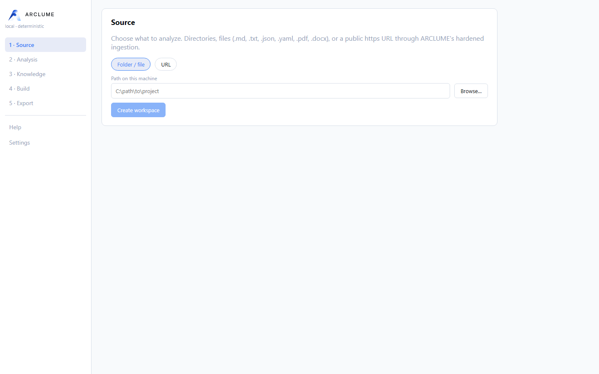
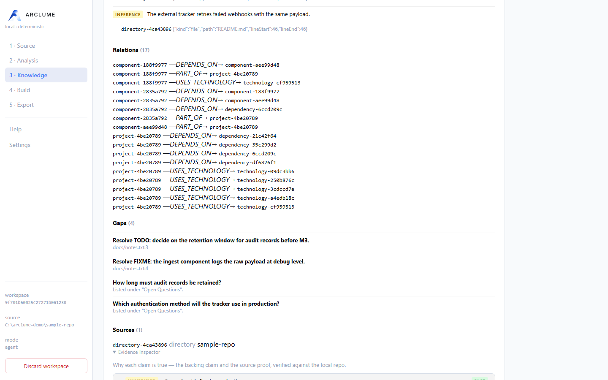
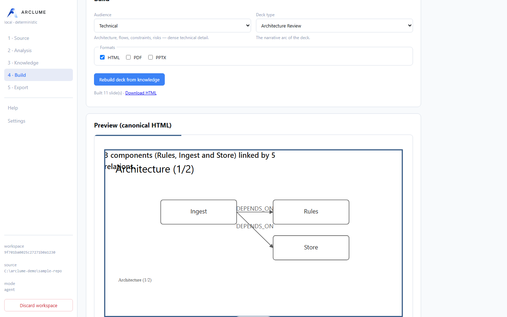
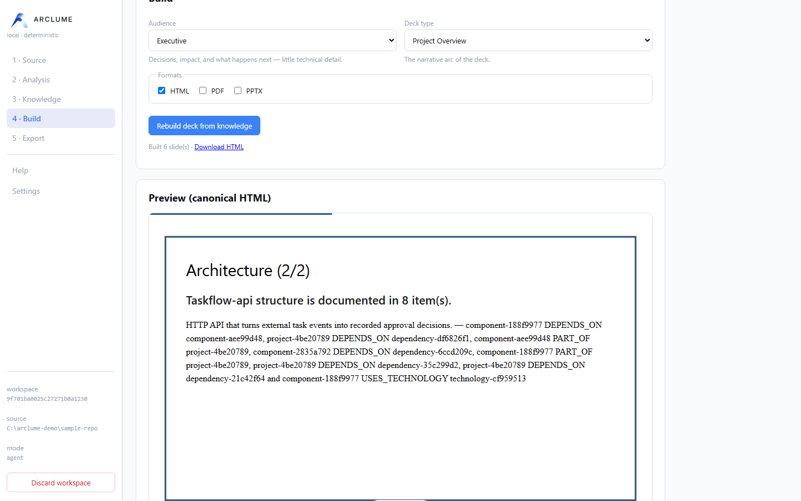
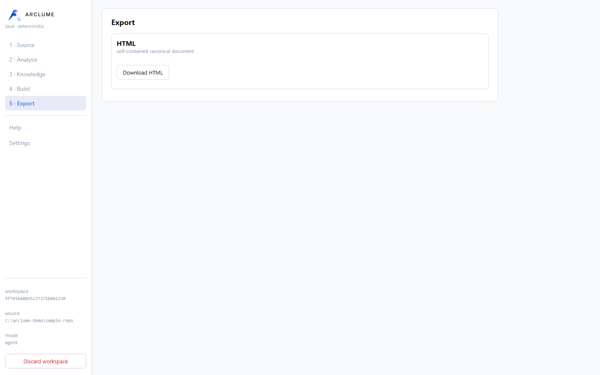

# ARCLUME

> Arclume turns complex projects into clear visual narratives.


**ARCLUME 1.0.2 is the current stable release.**

ARCLUME is a local-first engine that turns projects, documents, and HTTPS URLs into source-backed visual narratives and professional presentation decks.

**Outputs:** self-contained HTML • PDF • editable PPTX

---

## What is ARCLUME?

ARCLUME transforms an input — a project directory, a document, or a web page — into a validated presentation deck. Every claim in the deck traces back to a real source, and the analysis is digest-bound to the exact material that was ingested: the deck can only describe what was actually analyzed.

From the knowledge model onward, everything is deterministic: the same input produces the same presentation, byte for byte.

## Why ARCLUME?

- **No invented content** — generation is deterministic; the reasoning step is isolated behind a strict, schema-validated contract.
- **End-to-end traceability** — claims carry source references, locators, and evidence quotes; artifacts are hash-bound and sealed with receipts.
- **Local-first** — ARCLUME has no hosted account, analytics, or remote storage; the Web UI is loopback-only. URL ingestion performs only explicitly requested network acquisition, and privacy of external analysis depends on the agent or provider you choose.
- **Agent-ready** — an external agent produces the analysis through a file-based contract; no model SDK is bundled or required.

## What it can do

- Ingest projects, documents, and URLs into normalized, hash-provenanced source documents.
- Build a **ProjectKnowledge** model whose claims are classified as `FACT` / `INFERENCE` / `UNKNOWN` / `RECOMMENDATION` and backed by evidence.
- Verify source evidence hermetically (offline Git verification) — a fact is only *Verified* when its file, line range, and revision check out.
- Inspect every claim in the **Evidence Inspector**: verification badges, relative source paths, line ranges, revisions.
- Plan the narrative and slides deterministically for one of **six audience presets** and **nine deck types** — one key message per slide.
- Rebuild any number of decks from the same ProjectKnowledge without rerunning AI analysis.
- Direct visuals across **seven diagram families**: Architecture, Workflow, Sequence, Data Flow, Lifecycle, Timeline, and Roadmap — via native and vendored ARCLUME Visual Engine.
- Render one canonical, self-contained HTML presentation — offline, keyboard-driven, accessible.
- Export to PDF and editable PPTX as atomic bundles with receipts.
- Prove the rendered result with Chromium Visual QA: screenshots, geometry, contrast, zero-network and zero-console-error checks.
- Drive everything from the CLI, the local Web UI, or an agent workflow.

## How it works

```text
PROJECT / DOCUMENT / URL
        ↓
SAFE INGESTION        bounded, no execution
        ↓
ANALYSIS              external agent, or offline heuristic stub
        ↓
PROJECT KNOWLEDGE     validated model, evidence-backed
        ↓
NARRATIVE PLANNING    audience-shaped storyline
        ↓
SLIDE PLANNING        one key message per slide
        ↓
VISUAL DIRECTION      blocks, layouts, themes, diagrams
        ↓
ARCLUME DECK          validated deck IR
        ↓
HTML / PDF / PPTX     canonical render, atomic export, receipts
```

Everything from **Project Knowledge** onward is a pure, deterministic function of its inputs. The only stage that may reason is **Analysis**, reached through an explicit boundary — the rest of the pipeline verifies its output again.

## Screenshots

| | | |
| --- | --- | --- |
|  |  |  |
|  |  |  |

The workflow, left to right: create a workspace, inspect the evidence-backed
knowledge, choose an audience and a deck type, preview the deck, and export.

## Inputs

- Directories / projects (denylist- and `.gitignore`-aware walk)
- Markdown
- Plain text
- JSON
- YAML (safe core schema)
- PDF (text layer only — no OCR, embedded scripts never executed)
- DOCX (macros and OLE/embedded packages rejected)
- `https://` URLs (through the hardened SSRF boundary — see Security)

## Outputs

| Output | Description |
| --- | --- |
| `ProjectKnowledge` JSON | The validated knowledge model of the input. |
| `ArclumeDeck` JSON | The validated deck intermediate representation. |
| HTML presentation | One self-contained, offline file with an accessible keyboard viewer. |
| PDF export bundle | Atomic directory: `deck.pdf` + `export-receipt.json`. |
| PPTX export bundle | Atomic directory: editable `deck.pptx` + `export-receipt.json`. |
| Receipts | Cryptographic manifests binding artifact hashes, deck identity, versions, and provenance. |
| Visual QA artifacts | Per-slide screenshots, findings, and QA receipt. |

An **export bundle** is a directory ARCLUME stages, validates, hashes, and publishes atomically: the artifact plus a receipt binding its SHA-256, the deck identity, the exporter version, and diagram provenance. Bundles refuse to overwrite existing output and can be re-checked later with `arclume validate <bundle>`.

## Installation

ARCLUME is distributed as ready-to-run Windows builds — no Node.js, npm, or
browser installation is required. The Windows Installer and the portable ZIP
both bundle their own Node runtime and their own Chromium, so exports (HTML,
PDF, PPTX) work fully offline.

**Latest stable: ARCLUME 1.0.2**

| Download | What it is |
| --- | --- |
| [ARCLUME-Setup-1.0.2.exe](https://github.com/kerwilgil/arclume/releases/download/v1.0.2/ARCLUME-Setup-1.0.2.exe) | Windows installer (per-user, no admin rights) |
| [ARCLUME-1.0.2-portable.zip](https://github.com/kerwilgil/arclume/releases/download/v1.0.2/ARCLUME-1.0.2-portable.zip) | Self-contained portable build |
| [SHA256SUMS.txt](https://github.com/kerwilgil/arclume/releases/download/v1.0.2/SHA256SUMS.txt) | SHA-256 checksums for both artifacts |

Both artifacts are also available on the
[GitHub Releases](https://github.com/kerwilgil/arclume/releases) page for every
tagged version. The builds are not code-signed, so Windows SmartScreen may warn
on first run.

**1. Installer (recommended).** Run `ARCLUME-Setup-1.0.2.exe`. It installs
per-user into `%LOCALAPPDATA%\Programs\ARCLUME`, adds a Start Menu shortcut
(and optionally a desktop one), and launches ARCLUME with your browser.

**2. Portable.** Extract `ARCLUME-1.0.2-portable.zip` anywhere — including a
path with spaces or a removable drive — and double-click `ARCLUME.exe`.

Verify a download against the published checksums:

```powershell
Get-FileHash ARCLUME-Setup-1.0.2.exe -Algorithm SHA256
Get-FileHash ARCLUME-1.0.2-portable.zip -Algorithm SHA256
```

Or, on Linux/macOS with `sha256sum`:

```bash
sha256sum -c SHA256SUMS.txt
```

> The source development repository is private and is **not** distributed
> through this public repository. This repository exists to publish the
> releases, the public documentation, and the brand assets.

## Quick start

Once ARCLUME is running, create a workspace from a project, document, or URL,
and start with the offline heuristic preview:

```bash
arclume analyze ./project --reasoner stub --out knowledge.json
arclume build knowledge.json --preset executive --format html,pdf,pptx
```

The stub is a **heuristic, offline preview**: deterministic, useful for smoke tests and rapid iteration, and explicitly labeled as such by the CLI. It is **not agent-grade analysis**. For production decks, use the agent workflow below.

## Agent workflow

ARCLUME bundles no model SDK. An external agent performs the analysis through a strict, digest-bound file contract:

```bash
# 1. Write the deterministic analysis request (stops here — no reasoning done)
arclume analyze ./project --prepare-analysis analysis-request.json
```

The agent reads `analysis-request.json` — document ids, paths, outlines, and content — and produces an `arclume/agent-analysis` envelope whose `sourceDigest` matches the request verbatim.

```bash
# 2. Consume the bound result → validated ProjectKnowledge
arclume analyze ./project \
  --analysis-result analysis-result.json \
  --out project-knowledge.json

# 3. Build the deck
arclume build project-knowledge.json \
  --preset executive \
  --format html,pdf,pptx
```

A stale envelope is rejected (`reasoner/source-digest-mismatch`): the digest binds the analysis to the exact input content. The full contract is documented in [docs/CLI.md](docs/CLI.md).

## CLI

```text
arclume analyze <input...>   ingest → analysis → ProjectKnowledge
arclume build <knowledge>    knowledge → deck → HTML / PDF / PPTX bundles
arclume validate <path>      re-check a bundle, manifest, or knowledge file
arclume presets              list audience/theme presets
arclume watch <path>         offline heuristic rebuild loop
arclume web                  local Web UI (loopback only)
arclume --help               full usage
```

Machine-readable output with `--json`; exit codes `0` success, `1` usage, `2` build/validation, `3` security refusal.

## Local Web UI

```bash
arclume web
```

Starts the optional local interface at `http://127.0.0.1:3210` (localhost-only). It drives the same code paths as the CLI over a local workspace:

```text
source → analysis → knowledge → build → preview → export
```

It is not a hosted service or a cloud dashboard: no accounts, no sync, no remote storage — the browser talks to a loopback server on your machine, guarded by a per-session token, and the preview renders the canonical deck HTML byte for byte. The sidebar also carries a permanent, offline **Help** manual and **Settings** (**Language**: English / Español; **Appearance**: System / Light / Dark) — both persist locally and apply immediately, independent of any workspace.

## Watch

```bash
arclume watch ./project --reasoner stub --preset executive
```

Debounced rebuilds of the HTML deck while you iterate. Watch is an explicit **heuristic / offline rapid preview** loop: it never runs the agent workflow and never produces authoritative analysis. For production decks, run the agent workflow and `arclume build`.

## Audience & Deck Types

Six **audience presets** shape who the deck is for — narrative depth, technical
density, and evidence visibility:

| Audience | Intent |
| --- | --- |
| `executive` | Decisions, impact, recommendations; minimal technical detail |
| `technical` | Architecture, flows, constraints, risks; dense technical detail |
| `product` | Problem, users, capabilities, flows, outcomes |
| `client` | Clarity, benefits, status, deliverables |
| `investor` | Opportunity, differentiation, defensibility, roadmap |
| `internal-review` | Findings, uncertainty, risks, and full evidence visibility |

Nine **deck types** shape the narrative arc independently of the audience:

`project-overview`, `architecture-review`, `technical-deep-dive`,
`executive-brief`, `proposal`, `status-report`, `migration-plan`,
`product-overview`, `incident-postmortem`.

Audience and deck type compose: `technical + architecture-review` is deep and
structural, while `executive + architecture-review` is the same structure,
summarized for decisions. Combine them anytime with `--audience` / `--deck-type`.

## Traceability & evidence

- Claims are `FACT` / `INFERENCE` / `UNKNOWN` / `RECOMMENDATION`; a `FACT` without evidence is downgraded, never silently kept.
- Every claim carries source references with locators and evidence quotes.
- Artifacts are hash-bound across stages: analysis ↔ input (`sourceDigest`), deck ↔ knowledge (`provenance`), exports ↔ deck (receipts).
- `arclume validate` re-verifies export bundles and delivery manifests.

## Security — local-first by design

- Never executes the analyzed project's code.
- Never executes PDF JavaScript; PDF text-layer parsing only.
- Rejects DOCX macros and OLE/embedded packages.
- URL ingestion runs behind a hardened SSRF boundary: pinned DNS, scheme policy, byte budgets, no downgrade.
- Canonical rendering and export work fully offline.
- The Web UI listens on loopback (`127.0.0.1`) only.
- No analytics, no cloud account, no remote storage.
- Output validation, receipts, and provenance binding on every deliverable.

The full threat model and ingestion guarantees live in [SECURITY.md](SECURITY.md).

## Architecture

```text
INPUT
  ↓
INGESTION          safe, bounded, no execution
  ↓
ANALYSIS           pluggable Reasoner boundary
  ↓
PROJECT KNOWLEDGE  validated model
  ↓
NARRATIVE          audience-shaped storyline
  ↓
SLIDE PLAN         one key message per slide
  ↓
VISUAL DIRECTOR    blocks, layouts, themes, diagrams
  ↓
ARCLUME DECK       validated deck IR
  ↓
RENDER / EXPORT    canonical HTML → PDF / PPTX
  ↓
VALIDATION         Visual QA, receipts, verifiable bundles
```

ARCLUME is a headless core with thin clients (CLI, Web UI, agent skill): no logic lives only in a client.

### Diagram engines

ARCLUME includes the vendored ARCLUME Visual Engine for supported architecture/workflow diagrams, alongside its own native deterministic models. Attribution and licenses are in [THIRD_PARTY_NOTICES.md](THIRD_PARTY_NOTICES.md).

## Requirements

The packaged Windows builds (Installer and Portable) require **nothing** to be
installed — they carry their own Node runtime and Chromium.

For a from-source development environment:

- Node.js **>= 20.16.0** (ESM only).
- Chromium via Playwright — required for PDF export and Visual QA:

```bash
npx playwright install chromium
```

## Windows

ARCLUME has two distribution paths.

**1. Installer (for everyone).** `ARCLUME-Setup-1.0.2.exe` from the
[release page](https://github.com/kerwilgil/arclume/releases/tag/v1.0.2)
installs per-user, without administrator rights, and adds a Start Menu shortcut
(and optionally a desktop one). Launch ARCLUME and your browser opens on it.

**2. Portable.** Extract `ARCLUME-1.0.2-portable.zip` anywhere and
double-click `ARCLUME.exe`.

Both carry their own Node.js runtime and their own Chromium, so **nothing else
has to be installed** — no Node.js, no npm, no PowerShell 7, no
`playwright install`. Exports (HTML, PDF, PPTX) work offline.

See [docs/WINDOWS.md](docs/WINDOWS.md) for the distribution layout,
requirements and troubleshooting.

> **Note:** the Windows installer and portable artifacts are published on the
> [releases page](https://github.com/kerwilgil/arclume/releases). The builds
> are not code-signed, so SmartScreen may warn on first run.

## Current status

| Area | Status |
| --- | --- |
| Core (knowledge, deck IR, validation) | Stable |
| CLI | Stable |
| Web UI | Stable |
| Ingestion (PDF / DOCX / URL) | Stable |
| Export (HTML / PDF / PPTX) | Stable |
| Visual QA | Stable |
| Visual Engine | Stable |

**ARCLUME 1.0.2 is the current stable release.** See the
[release page](https://github.com/kerwilgil/arclume/releases/tag/v1.0.2) for the
tagged builds and checksums.

ARCLUME was previously known as ProjectDeck (historical reference only).

## Documentation

- CLI reference — [docs/CLI.md](docs/CLI.md)
- Windows guide — [docs/WINDOWS.md](docs/WINDOWS.md)
- Themes — [docs/THEMES.md](docs/THEMES.md)
- Viewer — [docs/VIEWER.md](docs/VIEWER.md)
- Release notes 1.0.0 — [docs/RELEASE_NOTES_1.0.0.md](docs/RELEASE_NOTES_1.0.0.md)
- Release notes 1.0.2 — [docs/RELEASE_NOTES_1.0.2.md](docs/RELEASE_NOTES_1.0.2.md)
- Changelog — [CHANGELOG.md](CHANGELOG.md)
- Security — [SECURITY.md](SECURITY.md)
- Third-party notices — [THIRD_PARTY_NOTICES.md](THIRD_PARTY_NOTICES.md)
- Releases — [GitHub Releases](https://github.com/kerwilgil/arclume/releases)

## License

MIT — see [LICENSE](LICENSE).