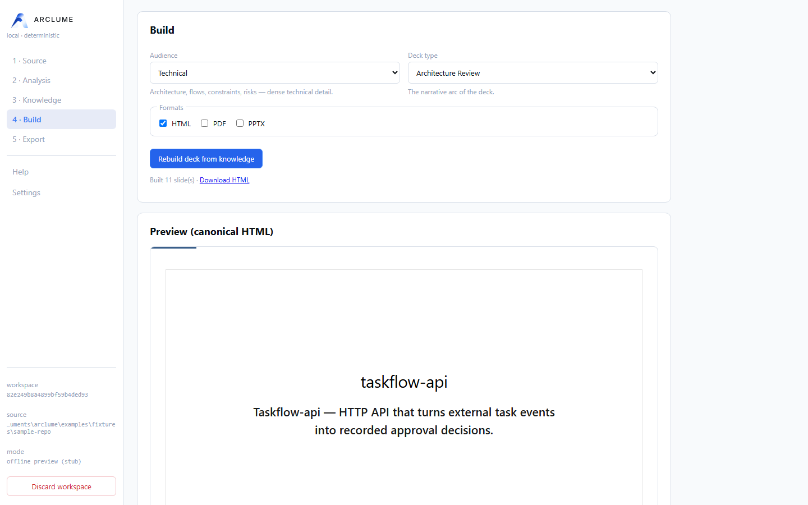
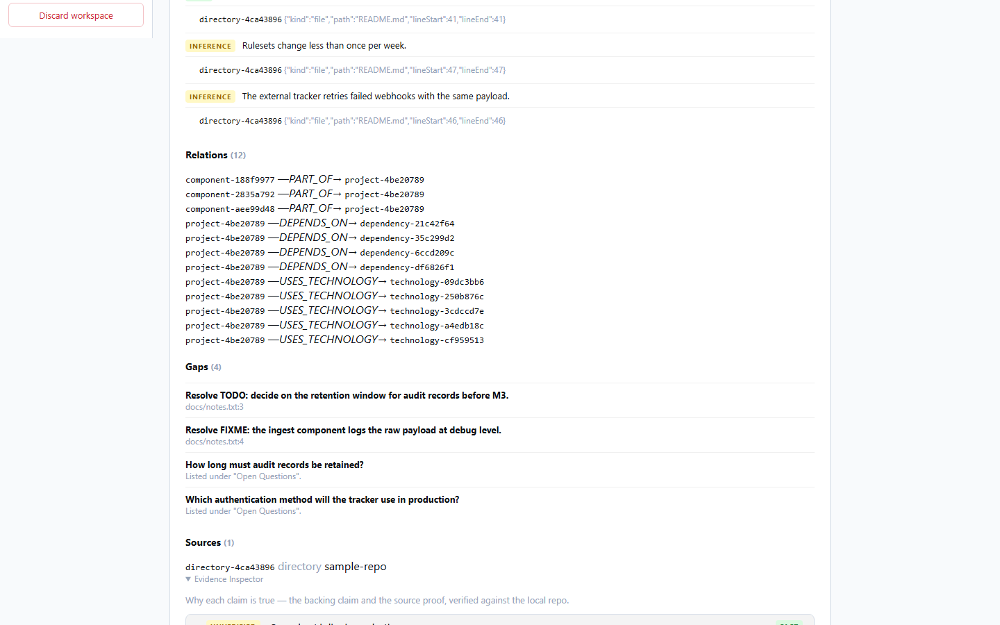
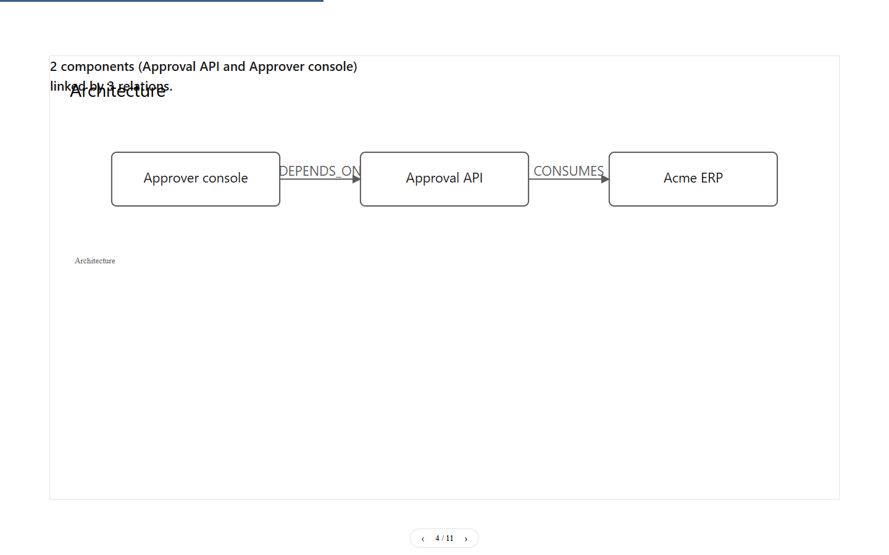
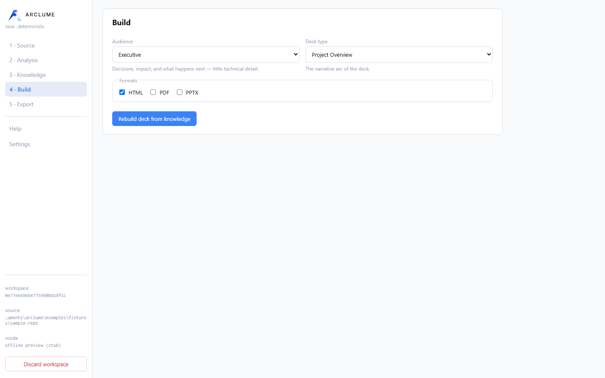

# ARCLUME

> Arclume turns complex projects into clear visual narratives.


ARCLUME is a local-first engine that turns projects, documents, and HTTPS URLs into source-backed visual narratives and professional presentation decks.

**Outputs:** self-contained HTML • PDF • editable PPTX

---

## What is ARCLUME?

ARCLUME transforms an input — a project directory, a document, or a web page — into a validated presentation deck. Every claim in the deck traces back to a real source, and the analysis is digest-bound to the exact material that was ingested: the deck can only describe what was actually analyzed.

From the knowledge model onward, everything is deterministic: the same input produces the same presentation, byte for byte.

## Why ARCLUME?

- **No invented content** — generation is deterministic; the reasoning step is isolated behind a strict, schema-validated contract.
- **End-to-end traceability** — claims carry source references, locators, and evidence quotes; artifacts are hash-bound and sealed with receipts.
- **Local-first** — ARCLUME has no hosted account, analytics, or remote storage; the Web UI is loopback-only. URL ingestion performs only explicitly requested network acquisition, and privacy of external analysis depends on the agent or provider you choose.
- **Agent-ready** — an external agent produces the analysis through a file-based contract; no model SDK is bundled or required.

## What it can do

- Ingest projects, documents, and URLs into normalized, hash-provenanced source documents.
- Build a **ProjectKnowledge** model whose claims are classified as `FACT` / `INFERENCE` / `UNKNOWN` / `RECOMMENDATION` and backed by evidence.
- Verify source evidence hermetically (offline Git verification) — a fact is only *Verified* when its file, line range, and revision check out.
- Inspect every claim in the **Evidence Inspector**: verification badges, relative source paths, line ranges, revisions.
- Plan the narrative and slides deterministically for one of **six audience presets** and **nine deck types** — one key message per slide.
- Rebuild any number of decks from the same ProjectKnowledge without rerunning AI analysis.
- Direct visuals across **seven diagram families**: Architecture, Workflow, Sequence, Data Flow, Lifecycle, Timeline, and Roadmap — via native and vendored ARCLUME Visual Engine.
- Render one canonical, self-contained HTML presentation — offline, keyboard-driven, accessible.
- Export to PDF and editable PPTX as atomic bundles with receipts.
- Prove the rendered result with Chromium Visual QA: screenshots, geometry, contrast, zero-network and zero-console-error checks.
- Drive everything from the CLI, the local Web UI, or an agent workflow.

## How it works

```text
PROJECT / DOCUMENT / URL
        ↓
SAFE INGESTION        bounded, no execution
        ↓
ANALYSIS              external agent, or offline heuristic stub
        ↓
PROJECT KNOWLEDGE     validated model, evidence-backed
        ↓
NARRATIVE PLANNING    audience-shaped storyline
        ↓
SLIDE PLANNING        one key message per slide
        ↓
VISUAL DIRECTION      blocks, layouts, themes, diagrams
        ↓
ARCLUME DECK          validated deck IR
        ↓
HTML / PDF / PPTX     canonical render, atomic export, receipts
```

Everything from **Project Knowledge** onward is a pure, deterministic function of its inputs. The only stage that may reason is **Analysis**, reached through an explicit boundary — the rest of the pipeline verifies its output again.

## Screenshots

| | |
| --- | --- |
|  |  |
|  |  |

The workflow, left to right: ingest a source, inspect the evidence-backed
knowledge, choose an audience and a deck type, preview the deck, and export.

## Inputs

- Directories / projects (denylist- and `.gitignore`-aware walk)
- Markdown
- Plain text
- JSON
- YAML (safe core schema)
- PDF (text layer only — no OCR, embedded scripts never executed)
- DOCX (macros and OLE/embedded packages rejected)
- `https://` URLs (through the hardened SSRF boundary — see Security)

## Outputs

| Output | Description |
| --- | --- |
| `ProjectKnowledge` JSON | The validated knowledge model of the input. |
| `ArclumeDeck` JSON | The validated deck intermediate representation. |
| HTML presentation | One self-contained, offline file with an accessible keyboard viewer. |
| PDF export bundle | Atomic directory: `deck.pdf` + `export-receipt.json`. |
| PPTX export bundle | Atomic directory: editable `deck.pptx` + `export-receipt.json`. |
| Receipts | Cryptographic manifests binding artifact hashes, deck identity, versions, and provenance. |
| Visual QA artifacts | Per-slide screenshots, findings, and QA receipt. |

An **export bundle** is a directory ARCLUME stages, validates, hashes, and publishes atomically: the artifact plus a receipt binding its SHA-256, the deck identity, the exporter version, and diagram provenance. Bundles refuse to overwrite existing output and can be re-checked later with `arclume validate <bundle>`.

## Quick start

Offline preview with the heuristic stub (after building from the repository — see [Installation](#installation)):

```bash
arclume analyze ./project --reasoner stub --out knowledge.json
arclume build knowledge.json --preset executive --format html,pdf,pptx
```

The stub is a **heuristic, offline preview**: deterministic, useful for smoke tests and rapid iteration, and explicitly labeled as such by the CLI. It is **not agent-grade analysis**. For production decks, use the agent workflow below.

## Agent workflow

ARCLUME bundles no model SDK. An external agent performs the analysis through a strict, digest-bound file contract:

```bash
# 1. Write the deterministic analysis request (stops here — no reasoning done)
arclume analyze ./project --prepare-analysis analysis-request.json
```

The agent reads `analysis-request.json` — document ids, paths, outlines, and content — and produces an `arclume/agent-analysis` envelope whose `sourceDigest` matches the request verbatim.

```bash
# 2. Consume the bound result → validated ProjectKnowledge
arclume analyze ./project \
  --analysis-result analysis-result.json \
  --out project-knowledge.json

# 3. Build the deck
arclume build project-knowledge.json \
  --preset executive \
  --format html,pdf,pptx
```

A stale envelope is rejected (`reasoner/source-digest-mismatch`): the digest binds the analysis to the exact input content. The full contract is documented in [SKILL.md](SKILL.md) and [docs/REASONER.md](docs/REASONER.md).

## CLI

```text
arclume analyze <input...>   ingest → analysis → ProjectKnowledge
arclume build <knowledge>    knowledge → deck → HTML / PDF / PPTX bundles
arclume validate <path>      re-check a bundle, manifest, or knowledge file
arclume presets              list audience/theme presets
arclume watch <path>         offline heuristic rebuild loop
arclume web                  local Web UI (loopback only)
arclume --help               full usage
```

Machine-readable output with `--json`; exit codes `0` success, `1` usage, `2` build/validation, `3` security refusal.

## Local Web UI

```bash
arclume web
```

Starts the optional local interface at `http://127.0.0.1:3210` (localhost-only). It drives the same code paths as the CLI over a local workspace:

```text
source → analysis → knowledge → build → preview → export
```

It is not a hosted service or a cloud dashboard: no accounts, no sync, no remote storage — the browser talks to a loopback server on your machine, guarded by a per-session token, and the preview renders the canonical deck HTML byte for byte. The sidebar also carries a permanent, offline **Help** manual and **Settings** (**Language**: English / Español; **Appearance**: System / Light / Dark) — both persist locally and apply immediately, independent of any workspace. Details in [docs/WEB_UI.md](docs/WEB_UI.md).

## Watch

```bash
arclume watch ./project --reasoner stub --preset executive
```

Debounced rebuilds of the HTML deck while you iterate. Watch is an explicit **heuristic / offline rapid preview** loop: it never runs the agent workflow and never produces authoritative analysis. For production decks, run the agent workflow and `arclume build`.

## Audience & Deck Types

Six **audience presets** shape who the deck is for — narrative depth, technical
density, and evidence visibility:

| Audience | Intent |
| --- | --- |
| `executive` | Decisions, impact, recommendations; minimal technical detail |
| `technical` | Architecture, flows, constraints, risks; dense technical detail |
| `product` | Problem, users, capabilities, flows, outcomes |
| `client` | Clarity, benefits, status, deliverables |
| `investor` | Opportunity, differentiation, defensibility, roadmap |
| `internal-review` | Findings, uncertainty, risks, and full evidence visibility |

Nine **deck types** shape the narrative arc independently of the audience:

`project-overview`, `architecture-review`, `technical-deep-dive`,
`executive-brief`, `proposal`, `status-report`, `migration-plan`,
`product-overview`, `incident-postmortem`.

Audience and deck type compose: `technical + architecture-review` is deep and
structural, while `executive + architecture-review` is the same structure,
summarized for decisions. Combine them anytime with `--audience` / `--deck-type`.

Legacy theme-oriented presets are still available:

| Preset | Audience | Theme | Intent |
| --- | --- | --- | --- |
| `executive` | executive | executive | Decision-oriented deck |
| `technical` | technical | minimal | Evidence-dense deck |
| `general` (default) | general | minimal | Neutral default |

## Traceability & evidence

- Claims are `FACT` / `INFERENCE` / `UNKNOWN` / `RECOMMENDATION`; a `FACT` without evidence is downgraded, never silently kept.
- Every claim carries source references with locators and evidence quotes.
- Artifacts are hash-bound across stages: analysis ↔ input (`sourceDigest`), deck ↔ knowledge (`provenance`), exports ↔ deck (receipts).
- `arclume validate` re-verifies export bundles and delivery manifests.

## Security — local-first by design

- Never executes the analyzed project's code.
- Never executes PDF JavaScript; PDF text-layer parsing only.
- Rejects DOCX macros and OLE/embedded packages.
- URL ingestion runs behind a hardened SSRF boundary: pinned DNS, scheme policy, byte budgets, no downgrade.
- Canonical rendering and export work fully offline.
- The Web UI listens on loopback (`127.0.0.1`) only.
- No analytics, no cloud account, no remote storage.
- Output validation, receipts, and provenance binding on every deliverable.

The full threat model and ingestion guarantees live in [docs/SECURITY.md](docs/SECURITY.md); export and delivery integrity in [docs/ATOMIC_DELIVERY.md](docs/ATOMIC_DELIVERY.md) and [docs/INGESTION.md](docs/INGESTION.md).

## Architecture

```text
INPUT
  ↓
INGESTION          safe, bounded, no execution
  ↓
ANALYSIS           pluggable Reasoner boundary
  ↓
PROJECT KNOWLEDGE  validated model
  ↓
NARRATIVE          audience-shaped storyline
  ↓
SLIDE PLAN         one key message per slide
  ↓
VISUAL DIRECTOR    blocks, layouts, themes, diagrams
  ↓
ARCLUME DECK       validated deck IR
  ↓
RENDER / EXPORT    canonical HTML → PDF / PPTX
  ↓
VALIDATION         Visual QA, receipts, verifiable bundles
```

ARCLUME is a headless core with thin clients (CLI, Web UI, agent skill): no logic lives only in a client. See [docs/ARCHITECTURE.md](docs/ARCHITECTURE.md).

### Diagram engines

ARCLUME includes the vendored ARCLUME Visual Engine for supported architecture/workflow diagrams, alongside its own native deterministic models. The visual engine is vendored under `vendor/archify/` (v2.16.0, MIT — © tt-a1i / Cocoon AI). Integration details in [docs/DIAGRAM_ENGINES.md](docs/DIAGRAM_ENGINES.md); attribution and licenses in [THIRD_PARTY_NOTICES.md](THIRD_PARTY_NOTICES.md).

## Requirements

- Node.js **>= 20.16.0** (ESM only).
- Chromium via Playwright — required for PDF export and Visual QA:

```bash
npx playwright install chromium
```

## Installation

### From the repository

```bash
git clone https://github.com/kerwilgil/arclume.git
cd arclume
npm ci
npm run build
```

The CLI is then available as `node dist/cli/index.js` (try `node dist/cli/index.js --help`), or linked as the `arclume` bin with `npm link`.

The official distribution channel for ARCLUME is the
[GitHub Releases](https://github.com/kerwilgil/arclume/releases) page — the
Windows installer and portable ZIP are published there. npm package
publication is not configured as a distribution channel.

## Windows

ARCLUME has three Windows paths, in order of preference.

**1. Installer (for everyone).** `ARCLUME-Setup-1.0.0.exe` from the
[release page](https://github.com/kerwilgil/arclume/releases/tag/v1.0.0)
installs per-user, without administrator rights, and adds a Start Menu shortcut
(and optionally a desktop one). Launch ARCLUME and your browser opens on it.

**2. Portable.** Extract `ARCLUME-1.0.0-portable.zip` anywhere and
double-click `ARCLUME.exe`.

Both carry their own Node.js runtime and their own Chromium, so **nothing else
has to be installed** — no Node.js, no npm, no PowerShell 7, no
`playwright install`. Exports (HTML, PDF, PPTX) work offline.

**3. Source checkout (for developers).** From a clone of this repository:

```text
double-click install-arclume.cmd     first-time setup
double-click ARCLUME.cmd             daily use
```

That path needs Node.js >= 20.16.0 and npm on the machine. CLI equivalent:

```powershell
node .\dist\cli\index.js web
```

See [docs/WINDOWS.md](docs/WINDOWS.md) for the distribution layout,
requirements and troubleshooting.

> **Note:** the Windows installer and portable artifacts are published on the
> [releases page](https://github.com/kerwilgil/arclume/releases). The builds
> are not code-signed, so SmartScreen may warn on first run.

## Current status

| Area | Status |
| --- | --- |
| Core (knowledge, deck IR, validation) | Stable |
| CLI | Stable |
| Web UI | Stable |
| Ingestion (PDF / DOCX / URL) | Stable |
| Export (HTML / PDF / PPTX) | Stable |
| Visual QA | Stable |
| Visual Engine | Stable |

**ARCLUME 1.0 is released.** See the
[release page](https://github.com/kerwilgil/arclume/releases) for the tagged
builds and checksums.

ARCLUME was previously known as ProjectDeck (historical reference only).

## Documentation

- Architecture — [docs/ARCHITECTURE.md](docs/ARCHITECTURE.md)
- ProjectKnowledge model — [docs/PROJECT_KNOWLEDGE.md](docs/PROJECT_KNOWLEDGE.md)
- ArclumeDeck IR — [docs/IR.md](docs/IR.md)
- Ingestion — [docs/INGESTION.md](docs/INGESTION.md); PDF/DOCX/URL boundaries and export — [docs/INGESTION.md](docs/INGESTION.md)
- Reasoner boundary & agent contract — [docs/REASONER.md](docs/REASONER.md), [SKILL.md](SKILL.md)
- Narrative & slide planning — [docs/NARRATIVE.md](docs/NARRATIVE.md), [docs/SLIDE_PLANNING.md](docs/SLIDE_PLANNING.md)
- Visual direction, themes, visual models — [docs/VISUAL_DIRECTOR.md](docs/VISUAL_DIRECTOR.md), [docs/THEMES.md](docs/THEMES.md), [docs/VISUAL_MODELS.md](docs/VISUAL_MODELS.md)
- Diagram engines (Visual Engine) — [docs/DIAGRAM_ENGINES.md](docs/DIAGRAM_ENGINES.md)
- HTML renderer & viewer — [docs/HTML_RENDERER.md](docs/HTML_RENDERER.md), [docs/VIEWER.md](docs/VIEWER.md)
- Visual QA & atomic delivery — [docs/VISUAL_QA.md](docs/VISUAL_QA.md), [docs/ATOMIC_DELIVERY.md](docs/ATOMIC_DELIVERY.md)
- CLI, presets, watch, packaging — [docs/CLI.md](docs/CLI.md)
- Web UI — [docs/WEB_UI.md](docs/WEB_UI.md)
- Security — [docs/SECURITY.md](docs/SECURITY.md)
- Versioning & stability — [docs/STABILITY.md](docs/STABILITY.md)
- Windows launcher — [docs/WINDOWS.md](docs/WINDOWS.md)

## License

MIT — see [LICENSE](LICENSE).

---

<details>
<summary>Español</summary>

# ARCLUME

> Arclume turns complex projects into clear visual narratives.


ARCLUME es un motor local-first que convierte proyectos, documentos y URLs HTTPS en narrativas visuales con procedencia y presentaciones profesionales.

**Salidas:** HTML autocontenido • PDF • PPTX editable

---

## Qué es ARCLUME

ARCLUME transforma una entrada — un directorio de proyecto, un documento o una página web — en una presentación validada. Cada afirmación en el deck remite a una fuente real, y el análisis está ligado por digest al material exacto ingerido: el deck solo puede describir lo que realmente se analizó.

Desde el modelo de conocimiento en adelante todo es determinista: la misma entrada produce la misma presentación, byte a byte.

## Por qué ARCLUME

- **Sin contenido inventado** — la generación es determinista y el paso de razonamiento queda aislado detrás de un contrato estricto, validado por esquema.
- **Trazabilidad de extremo a extremo** — las afirmaciones llevan referencias a fuentes, localizadores y citas textuales; los artefactos quedan ligados por hashes y sellados con recibos.
- **Local-first** — ARCLUME no tiene cuentas alojadas, analíticas ni almacenamiento remoto propio; la Web UI funciona solo en loopback. La ingesta de URLs realiza únicamente el acceso de red solicitado explícitamente, y la privacidad del análisis externo depende del agente o proveedor que elijas.
- **Agent-ready** — un agente externo produce el análisis a través de un contrato basado en archivos; no se incluye ni requiere ningún SDK de modelo.

## Qué puede hacer

- Ingesta proyectos, documentos y URLs en documentos fuente normalizados, con hash de procedencia.
- Construye un modelo **ProjectKnowledge** cuyas afirmaciones se clasifican como `FACT` / `INFERENCE` / `UNKNOWN` / `RECOMMENDATION` y están respaldadas por evidencia.
- Verifica la evidencia de fuente de forma hermética (verificación Git sin red) — un hecho solo está *Verificado* cuando su archivo, rango de líneas y revisión coinciden.
- Inspecciona cada afirmación en el **Inspector de evidencia**: insignias de verificación, rutas de fuente relativas, rangos de líneas, revisiones.
- Planifica la narrativa y las diapositivas de forma determinista para uno de **seis presets de audiencia** y **nueve tipos de deck** — un mensaje clave por diapositiva.
- Reconstruye cualquier número de decks a partir del mismo ProjectKnowledge sin volver a ejecutar el análisis de IA.
- Dirige los visuales en **siete familias de diagramas**: Arquitectura, Flujo de trabajo, Secuencia, Flujo de datos, Ciclo de vida, Línea de tiempo y Hoja de ruta — mediante motores nativos y ARCLUME Visual Engine vendored.
- Renderiza un HTML de presentación único, autocontenido — offline, controlado por teclado, accesible.
- Exporta a PDF y PPTX editable como bundles atómicos con recibos.
- Demuestra el resultado renderizado con Visual QA en Chromium: capturas, geometría, contraste, comprobaciones de red-cero y consola-cero.
- Dirige todo desde la CLI, la interfaz web local o un flujo de agente.

## Cómo funciona

```text
PROJECT / DOCUMENT / URL
        ↓
SAFE INGESTION       acotada, sin ejecución
        ↓
ANALYSIS             agente externo, o stub heurístico offline
        ↓
PROJECT KNOWLEDGE    modelo validado, con evidencia
        ↓
NARRATIVE PLANNING   historia adaptada a la audiencia
        ↓
SLIDE PLANNING       un mensaje clave por diapositiva
        ↓
VISUAL DIRECTION     bloques, layouts, temas, diagramas
        ↓
ARCLUME DECK         IR de deck validado
        ↓
HTML / PDF / PPTX    render canónico, export atómico, recibos
```

Todo desde **Project Knowledge** en adelante es una función pura y determinista de sus entradas. La única etapa que puede razonar es **Analysis**, alcanzada a través de un límite explícito — el resto del pipeline vuelve a validar su salida.

## Capturas

| | |
| --- | --- |
|  |  |
|  |  |

El flujo, de izquierda a derecha: ingesta una fuente, inspecciona el
conocimiento respaldado por evidencia, elige una audiencia y un tipo de deck,
previsualiza el deck y exporta.

## Entradas

- Directorios / proyectos (recorrido con denylist y respeto a `.gitignore`)
- Markdown
- Texto plano
- JSON
- YAML (esquema core seguro)
- PDF (solo capa de texto — sin OCR, scripts incrustados nunca ejecutados)
- DOCX (macros y paquetes OLE/embebidos rechazados)
- URLs `https://` (a través del límite SSRF endurecido — ver Seguridad)

## Salidas

| Salida | Descripción |
| --- | --- |
| `ProjectKnowledge` JSON | El modelo de conocimiento validado de la entrada. |
| `ArclumeDeck` JSON | La representación intermedia de deck validada. |
| Presentación HTML | Un archivo autocontenido offline con visor accesible por teclado. |
| Bundle de exportación PDF | Directorio atómico: `deck.pdf` + `export-receipt.json`. |
| Bundle de exportación PPTX | Directorio atómico: `deck.pptx` editable + `export-receipt.json`. |
| Recibos | Manifiestos criptográficos ligando hashes de artefacto, identidad de deck, versiones y procedencia. |
| Artefactos de Visual QA | Capturas por diapositiva, hallazgos y recibo de QA. |

Un **bundle de exportación** es un directorio que ARCLUME prepara, valida, hashea y publica atómicamente: el artefacto más un recibo que liga su SHA-256, la identidad del deck, la versión del exportador y la procedencia de diagramas. Los bundles rechazan sobrescribir salidas existentes y pueden re-verificarse después con `arclume validate <bundle>`.

## Inicio rápido

Vista previa offline con el stub heurístico (tras construir desde el repositorio — ver [Instalación](#instalación)):

```bash
arclume analyze ./project --reasoner stub --out knowledge.json
arclume build knowledge.json --preset executive --format html,pdf,pptx
```

El stub es una **vista previa heurística y offline**: determinista, útil para tests de humo e iteración rápida, y etiquetado explícitamente como tal por la CLI. **No es análisis de grado agente**. Para decks de producción, usa el flujo de agente abajo.

## Flujo de trabajo con agente

ARCLUME no incluye ningún SDK de modelo. Un agente externo realiza el análisis a través de un contrato estricto de archivos ligado por digest:

```bash
# 1. Escribe la petición de análisis determinista (se detiene aquí — sin razonar)
arclume analyze ./project --prepare-analysis analysis-request.json
```

El agente lee `analysis-request.json` — ids de documentos, rutas, esquemas y contenido — y produce un sobre `arclume/agent-analysis` cuyo `sourceDigest` coincide verbatim con la petición.

```bash
# 2. Consume el resultado ligado → ProjectKnowledge validado
arclume analyze ./project \
  --analysis-result analysis-result.json \
  --out project-knowledge.json

# 3. Construye el deck
arclume build project-knowledge.json \
  --preset executive \
  --format html,pdf,pptx
```

Un sobre desactualizado es rechazado (`reasoner/source-digest-mismatch`): el digest liga el análisis al contenido exacto de la entrada. El contrato completo está documentado en [SKILL.md](SKILL.md) y [docs/REASONER.md](docs/REASONER.md).

## CLI

```text
arclume analyze <input...>   ingesta → análisis → ProjectKnowledge
arclume build <knowledge>    knowledge → deck → bundles HTML / PDF / PPTX
arclume validate <path>      re-verifica un bundle, manifiesto o knowledge
arclume presets              lista presets de audiencia/tema
arclume watch <path>         bucle de rebuild heurístico offline
arclume web                  interfaz web local (solo loopback)
arclume --help               uso completo
```

Salida máquina-legible con `--json`; códigos de salida `0` éxito, `1` uso, `2` build/validación, `3` rechazo seguridad.

## Interfaz web local

```bash
arclume web
```

Arranca la interfaz local opcional en `http://127.0.0.1:3210` (solo loopback). Dirige los mismos caminos de código que la CLI sobre un espacio de trabajo local:

```text
source → analysis → knowledge → build → preview → export
```

No es un servicio hospedado ni un dashboard en la nube: sin cuentas, sin sync, sin almacenamiento remoto — el navegador habla con un servidor loopback en tu máquina, protegido por token por sesión, y el preview renderiza el HTML canónico del deck byte a byte. El sidebar también tiene un manual de **Ayuda** offline permanente y **Configuración** (**Idioma**: English / Español; **Apariencia**: Sistema / Claro / Oscuro) — ambos se guardan localmente y se aplican de inmediato, sin depender de ningún workspace. Detalles en [docs/WEB_UI.md](docs/WEB_UI.md).

## Watch

```bash
arclume watch ./project --reasoner stub --preset executive
```

Rebuilds con debounce del HTML del deck mientras iteras. Watch es un bucle explícito de **vista previa heurística / offline rápida**: nunca ejecuta el flujo de agente y nunca produce análisis autoritativo. Para decks de producción, ejecuta el flujo de agente y `arclume build`.

## Audiencia y tipos de deck

Seis **presets de audiencia** definen para quién es el deck — profundidad
narrativa, densidad técnica y visibilidad de evidencia:

| Audiencia | Intención |
| --- | --- |
| `executive` | Decisiones, impacto, recomendaciones; mínimo detalle técnico |
| `technical` | Arquitectura, flujos, restricciones, riesgos; detalle técnico denso |
| `product` | Problema, usuarios, capacidades, flujos, resultados |
| `client` | Claridad, beneficios, estado, entregables |
| `investor` | Oportunidad, diferenciación, defendibilidad, hoja de ruta |
| `internal-review` | Hallazgos, incertidumbre, riesgos y máxima visibilidad de evidencia |

Nueve **tipos de deck** definen el arco narrativo con independencia de la audiencia:

`project-overview`, `architecture-review`, `technical-deep-dive`,
`executive-brief`, `proposal`, `status-report`, `migration-plan`,
`product-overview`, `incident-postmortem`.

Audiencia y tipo se combinan: `technical + architecture-review` es profundo y
estructural, mientras que `executive + architecture-review` es la misma
estructura resumida para decisiones. Combínalos con `--audience` / `--deck-type`.

Los presets legacy orientados a tema siguen disponibles:

| Preset | Audiencia | Tema | Intención |
| --- | --- | --- | --- |
| `executive` | executive | executive | Deck orientado a decisiones |
| `technical` | technical | minimal | Deck denso en evidencia |
| `general` (default) | general | minimal | Default neutro |

## Trazabilidad y evidencia

- Las afirmaciones son `FACT` / `INFERENCE` / `UNKNOWN` / `RECOMMENDATION`; un `FACT` sin evidencia se degrada, nunca se mantiene en silencio.
- Cada afirmación lleva referencias a fuente con localizadores y citas textuales.
- Los artefactos están ligados por hash entre etapas: análisis ↔ entrada (`sourceDigest`), deck ↔ knowledge (`provenance`), exports ↔ deck (recibos).
- `arclume validate` re-verifica bundles de exportación y manifiestos de entrega.

## Seguridad — local-first por diseño

- Nunca ejecuta código del proyecto analizado.
- Nunca ejecuta JavaScript de PDF; solo parsing de capa de texto.
- Rechaza macros y paquetes OLE/embebidos en DOCX.
- La ingesta de URLs corre tras un límite SSRF endurecido: DNS fijado, política de esquema, presupuestos de bytes, sin downgrade.
- El render canónico y la exportación funcionan totalmente offline.
- La Web UI escucha solo en loopback (`127.0.0.1`).
- Sin analíticas, sin cuenta en la nube, sin almacenamiento remoto.
- Validación de salida, recibos y liga de procedencia en cada entregable.

El modelo de amenazas completo y garantías de ingesta están en [docs/SECURITY.md](docs/SECURITY.md); integridad de exportación y entrega en [docs/ATOMIC_DELIVERY.md](docs/ATOMIC_DELIVERY.md) y [docs/INGESTION.md](docs/INGESTION.md).

## Arquitectura

```text
INPUT
  ↓
INGESTION          segura, acotada, sin ejecución
  ↓
ANALYSIS           límite Reasoner enchufable
  ↓
PROJECT KNOWLEDGE  modelo validado
  ↓
NARRATIVE          historia adaptada a audiencia
  ↓
SLIDE PLAN         un mensaje clave por diapositiva
  ↓
VISUAL DIRECTOR    bloques, layouts, temas, diagramas
  ↓
ARCLUME DECK       IR de deck validado
  ↓
RENDER / EXPORT    HTML canónico → PDF / PPTX
  ↓
VALIDATION         Visual QA, recibos, bundles verificables
```

ARCLUME es un core headless con clientes ligeros (CLI, Web UI, skill de agente): ninguna lógica vive solo en un cliente. Ver [docs/ARCHITECTURE.md](docs/ARCHITECTURE.md).

### Motores de diagrama

ARCLUME incluye el motor visual ARCLUME vendored para diagramas de arquitectura/flujo de trabajo soportados, junto a sus propios modelos deterministas nativos. El motor visual está vendored bajo `vendor/archify/` (v2.16.0, MIT — © tt-a1i / Cocoon AI). Detalles de integración en [docs/DIAGRAM_ENGINES.md](docs/DIAGRAM_ENGINES.md); atribución y licencias en [THIRD_PARTY_NOTICES.md](THIRD_PARTY_NOTICES.md).

## Requisitos

- Node.js **>= 20.16.0** (solo ESM).
- Chromium vía Playwright — requerido para exportación PDF y Visual QA:

```bash
npx playwright install chromium
```

## Instalación

### Desde el repositorio

```bash
git clone https://github.com/kerwilgil/arclume.git
cd arclume
npm ci
npm run build
```

La CLI queda disponible como `node dist/cli/index.js` (prueba `node dist/cli/index.js --help`), o linkeada como bin `arclume` con `npm link`.

El canal oficial de distribución de ARCLUME es la página de
[GitHub Releases](https://github.com/kerwilgil/arclume/releases) — allí se
publican el instalador de Windows y el ZIP portable. La publicación en npm no
está configurada como canal de distribución.

## Windows

ARCLUME tiene tres vías en Windows, por orden de preferencia.

**1. Instalador (para cualquier persona).** `ARCLUME-Setup-1.0.0.exe`, desde
la [página de release](https://github.com/kerwilgil/arclume/releases/tag/v1.0.0),
instala por usuario, sin permisos de administrador, y crea un acceso directo en
el menú Inicio (y opcionalmente en el escritorio). Al abrir ARCLUME, el
navegador se abre solo.

**2. Portable.** Descomprimir `ARCLUME-1.0.0-portable.zip` donde sea y
doble clic en `ARCLUME.exe`.

Ambas llevan su propio runtime de Node.js y su propio Chromium: **no hay que
instalar nada más** — ni Node.js, ni npm, ni PowerShell 7, ni
`playwright install`. Las exportaciones (HTML, PDF, PPTX) funcionan sin
conexión.

**3. Checkout del código (para desarrolladores).** Desde un clon de este
repositorio:

```text
double-click install-arclume.cmd     primera instalación
double-click ARCLUME.cmd             uso diario
```

Esa vía sí requiere Node.js >= 20.16.0 y npm en la máquina. Equivalente CLI:

```powershell
node .\dist\cli\index.js web
```

Ver [docs/WINDOWS.md](docs/WINDOWS.md) para el layout de la distribución,
requisitos y solución de problemas.

> **Nota:** el instalador y el portable de Windows están publicados en la
> [página de releases](https://github.com/kerwilgil/arclume/releases). Las
> builds no están firmadas digitalmente, por lo que SmartScreen puede advertir
> en el primer arranque.

## Estado actual

| Área | Estado |
| --- | --- |
| Core (knowledge, deck IR, validación) | Estable |
| CLI | Estable |
| Web UI | Estable |
| Ingesta (PDF / DOCX / URL) | Estable |
| Export (HTML / PDF / PPTX) | Estable |
| Visual QA | Estable |
| Motor visual ARCLUME | Estable |

**ARCLUME 1.0 ya está publicado.** Consulta la
[página de release](https://github.com/kerwilgil/arclume/releases) para las
builds etiquetadas y sus checksums.

ARCLUME se llamó anteriormente ProjectDeck (referencia histórica únicamente).

## Documentación

- Arquitectura — [docs/ARCHITECTURE.md](docs/ARCHITECTURE.md)
- Modelo ProjectKnowledge — [docs/PROJECT_KNOWLEDGE.md](docs/PROJECT_KNOWLEDGE.md)
- IR ArclumeDeck — [docs/IR.md](docs/IR.md)
- Ingesta — [docs/INGESTION.md](docs/INGESTION.md); límites PDF/DOCX/URL y export — [docs/INGESTION.md](docs/INGESTION.md)
- Límite Reasoner y contrato agente — [docs/REASONER.md](docs/REASONER.md), [SKILL.md](SKILL.md)
- Planificación narrativa y de slides — [docs/NARRATIVE.md](docs/NARRATIVE.md), [docs/SLIDE_PLANNING.md](docs/SLIDE_PLANNING.md)
- Dirección visual, temas, modelos visuales — [docs/VISUAL_DIRECTOR.md](docs/VISUAL_DIRECTOR.md), [docs/THEMES.md](docs/THEMES.md), [docs/VISUAL_MODELS.md](docs/VISUAL_MODELS.md)
- Motores de diagrama (Visual Engine) — [docs/DIAGRAM_ENGINES.md](docs/DIAGRAM_ENGINES.md)
- Renderer HTML y viewer — [docs/HTML_RENDERER.md](docs/HTML_RENDERER.md), [docs/VIEWER.md](docs/VIEWER.md)
- Visual QA y entrega atómica — [docs/VISUAL_QA.md](docs/VISUAL_QA.md), [docs/ATOMIC_DELIVERY.md](docs/ATOMIC_DELIVERY.md)
- CLI, presets, watch, packaging — [docs/CLI.md](docs/CLI.md)
- Web UI — [docs/WEB_UI.md](docs/WEB_UI.md)
- Seguridad — [docs/SECURITY.md](docs/SECURITY.md)
- Versionado y estabilidad — [docs/STABILITY.md](docs/STABILITY.md)
- Windows launcher — [docs/WINDOWS.md](docs/WINDOWS.md)

## Licencia

MIT — ver [LICENSE](LICENSE).
</details>